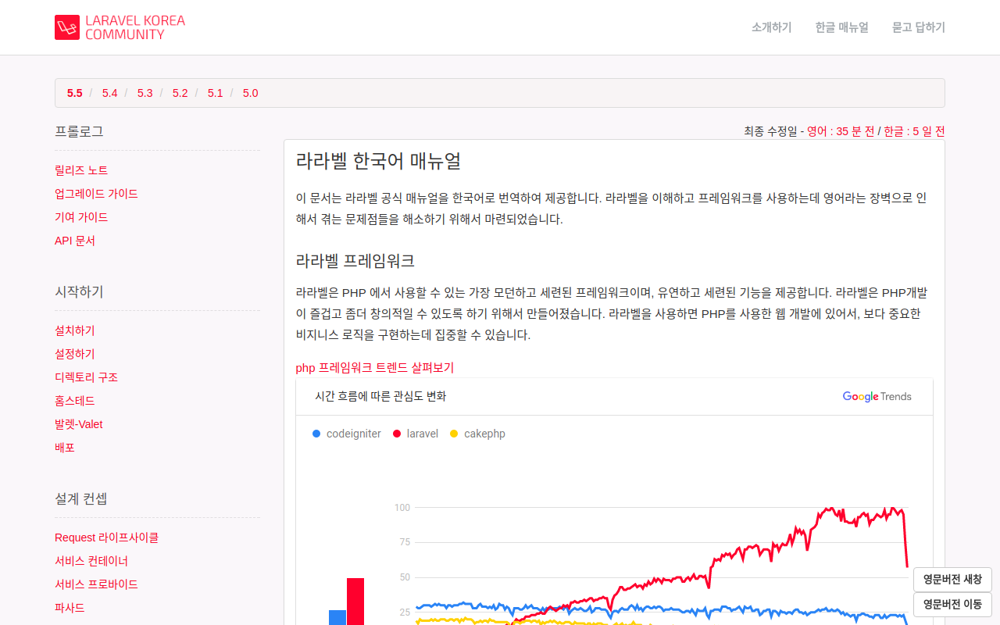
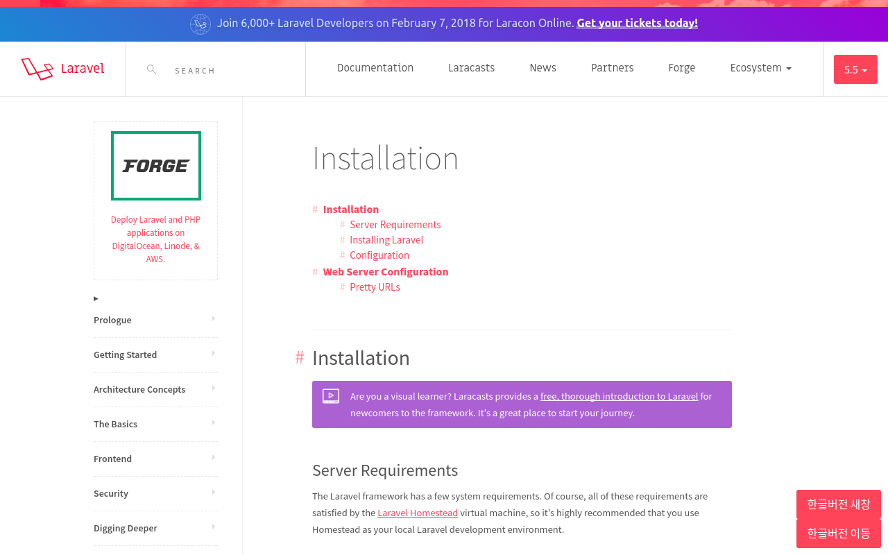

Laravel Doc Changer
=====
한글 메뉴얼 사이트 (https://laravel.kr)와 영문 메뉴얼 사이트 (https://laravel.com) 간의 이동을 도와주는 버튼을 생성해줍니다. 

[바로가기](https://chrome.google.com/webstore/detail/laraveldoclanguagechanger/ecfgiofgodbggdedgdeoeagmhgdbljhe)

Screenshots
-----

## 한글버전

## 영문버전

Issues
-----

이슈는 [[여기](http://github.com/kkame/laravel-doc-changer/issues)]에 등록해주세요.

TODO
-----
- 환경설정에서 영문페이지의 경우 강제 한글페이지로 이동하는 기능 추가
- 바로 전환 가능한 단축키 추가 

License
-----

[MIT](http://opensource.org/licenses/MIT)

 